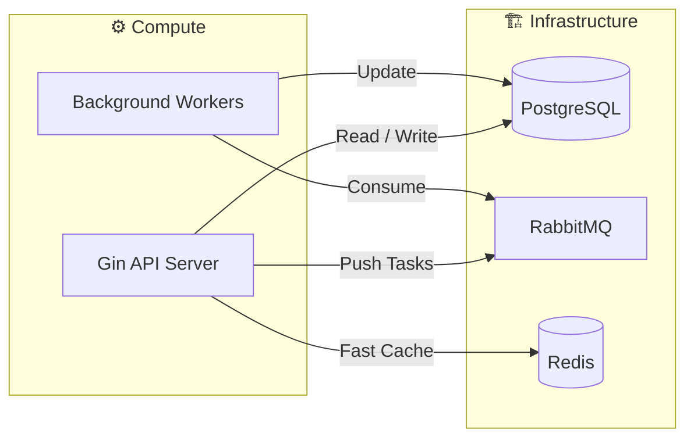
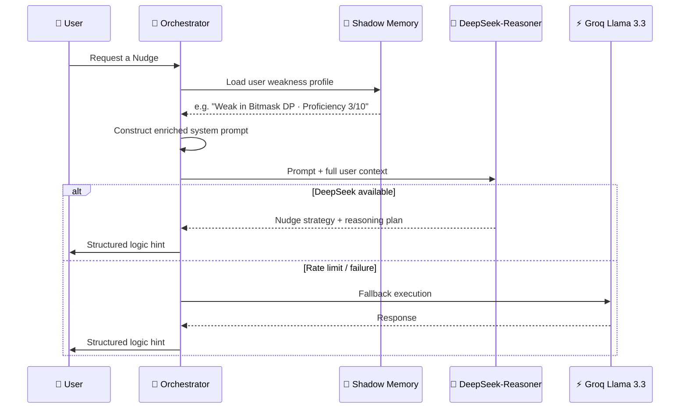
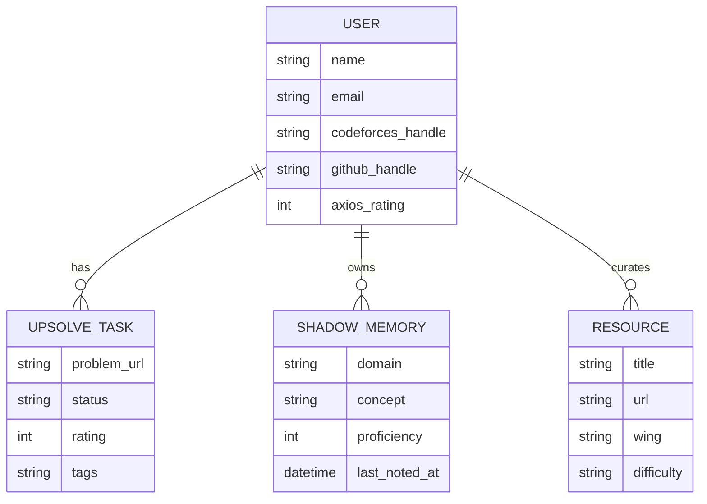

<div align="center">

<br/>

<br/>

```
████████╗███████╗ ██████╗██╗  ██╗     █████╗ ██████╗  ██████╗██╗  ██╗
╚══██╔══╝██╔════╝██╔════╝██║  ██║   ██╔══██╗██╔══██╗██╔════╝██║  ██║
   ██║   █████╗  ██║     ███████║   ███████║██████╔╝██║     ███████║
   ██║   ██╔══╝  ██║     ██╔══██║   ██╔══██║██╔══██╗██║     ██╔══██║
   ██║   ███████╗╚██████╗██║  ██║   ██║  ██║██║  ██║╚██████╗██║  ██║
   ╚═╝   ╚══════╝ ╚═════╝╚═╝  ╚═╝   ╚═╝  ╚═╝╚═╝  ╚═╝ ╚═════╝╚═╝  ╚═╝
```

### **Deep Technical Architecture**

*System design, data flows, and the engineering decisions behind the Nexus.*

<br/>

[](#1-system-philosophy-the-decoupled-agentic-engine)
[](#2-component-breakdown)
[](#3-data-flows--pipelines)
[](#4-database-schema-gorm)
[](#5-infrastructure--scalability)

</div>

---

<br/>

## 01 · System Philosophy · The Decoupled Agentic Engine

AXIOS-GO is not a traditional CRUD application. It is an **Agentic Engine** — a *Second Brain* for developers. The architecture is explicitly designed to handle high-latency external API calls (GitHub, Codeforces) and heavy LLM reasoning **without ever blocking the user experience**.

<br/>

### The "Nexus" Core

The Go backend is the central nervous system. Three responsibilities, cleanly separated:

```
┌────────────────────────────────────────────────────────────────┐
│                        THE NEXUS                               │
├──────────────────┬─────────────────────┬───────────────────────┤
│  State           │  Async              │  Reasoning            │
│  Persistence     │  Orchestration      │  Routing              │
│                  │                     │                       │
│  PostgreSQL       │  RabbitMQ           │  Multi-Provider AI    │
│  (source of      │  (task queue for    │  (DeepSeek → Groq     │
│   truth)         │   background work)  │   fallback chain)     │
└──────────────────┴─────────────────────┴───────────────────────┘
```



<br/>

---

## 02 · Component Breakdown

<br/>

### Backend · Go / Gin

Chosen for **high concurrency** and **compile-time type safety** — exactly what an always-on agentic engine needs.

```
backend/
│
├── Middleware Layer
│   ├── JWT Validation      → strict token auth on every protected route
│   └── CORS                → secure frontend-backend handshake
│
├── Service Layer
│   ├── CP Service          → upsolve logic, CF integration
│   ├── Dev Service         → GitHub audit, PR diff fetching
│   ├── ML Service          → concept lab, roadmap generation
│   └── AI Orchestrator     → the central intelligence hub
│
└── AI Orchestrator (core)
    ├── Prompt Engineering  → injects Shadow Memory into every AI call
    ├── DeepSeek-Reasoner   → decomposes complex prompts into sub-tasks
    └── Groq Fallback       → auto-switches on rate limits or failure
```

<br/>

### Frontend · React / Vite

A high-performance SPA focused on **immersive technical experiences**.

```
frontend/
│
├── State Management
│   └── React Context API   → lightweight global auth state
│
├── UI System
│   ├── Tailwind CSS        → rapid, consistent styling
│   └── Shadcn/UI           → premium component library
│
└── Visualization Layer
    ├── Three.js             → 3D scene rendering
    └── React Three Fiber    → declarative 3D for interactive roadmaps
```

<br/>

---

## 03 · Data Flows & Pipelines

<br/>

### The Upsolve Pipeline · CP Wing

A critical background process ensuring data is always fresh — even when the user is offline.

```
Step 1 · SCHEDULE
  └── robfig/cron fires every 4 hours
          │
          ▼
Step 2 · FETCH
  └── Codeforces API queried for all active users
          │
          ▼
Step 3 · FILTER
  └── Identify Non-OK verdicts:
      · Wrong Answer (WA)
      · Time Limit Exceeded (TLE)
      · Runtime Error (RE)
          │
          ▼
Step 4 · QUEUE
  └── Message pushed to RabbitMQ per new task
          │
          ▼
Step 5 · CONSUME
  └── Worker performs deduplicated UPSERT
      into upsolve_tasks table
      status → 'pending'
```

> **Why RabbitMQ?** If the Codeforces API is slow or down, the sync job doesn't crash the main server. Tasks are retried automatically.

<br/>

### AI Orchestration Flow · CodeSensei



**Multi-Model Fallback ensures 99.9% AI availability** — DeepSeek handles deep reasoning; Groq handles speed and resilience.

<br/>

---

## 04 · Database Schema · GORM

<br/>

### Entity Relationship Diagram



<br/>

### Core Models · Reference

| Model | Purpose | Key Fields |
|-------|---------|-----------|
| `User` | Identity & aggregate score | `codeforces_handle`, `github_handle`, `axios_rating` |
| `ShadowMemory` | Per-concept proficiency tracker | `domain`, `concept`, `proficiency (1–10)`, `last_noted_at` |
| `UpsolveTask` | Failed problem queue item | `problem_url`, `status (pending/solved)`, `rating`, `tags` |
| `Resource` | Curated learning library | `title`, `url`, `wing`, `difficulty` |

<br/>

---

## 05 · Infrastructure & Scalability

<br/>

### Messaging · RabbitMQ

```
Without RabbitMQ:                  With RabbitMQ:
                                   
  Cron ──▶ CF API (slow)             Cron ──▶ RabbitMQ (instant enqueue)
       └──▶ Server blocks ❌               └──▶ Worker consumes async ✅
            user requests fail              server stays responsive
```

Tasks are automatically **retried** on failure — the sync pipeline is resilient to external API outages.

<br/>

### Caching · Redis

```
Request flow with Redis:

  User request ──▶ Redis hit? ──YES──▶ Return cached ⚡ (< 1ms)
                       │
                      NO
                       │
                       ▼
               PostgreSQL query ──▶ Store in Redis ──▶ Return result
```

Used for session caching and future-phase rate limiting.

<br/>

### Containerization · Docker Compose

```bash
# One-command local setup — the entire infrastructure, ready in seconds
docker-compose up -d

# Spins up:
# ├── PostgreSQL  (port 5432)
# ├── Redis       (port 6379)
# └── RabbitMQ    (port 5672 · management UI on 15672)
```

Zero manual configuration. Zero dependency hell.

<br/>

---

## 06 · The Axios Rating Algorithm

Calculated every **24 hours** via background cron. Designed to reward cross-disciplinary excellence — not just grinding one skill.

```go
// Go implementation
AxiosRating = (normalizedCF * 0.5) + (cfSolved * 5) + (githubRepos * 20) + (githubPRs * 50)
```

<br/>

**Weight Rationale:**

```
┌─────────────────────────────────────────────────────────────────┐
│  normalizedCF  × 0.5  →  Raw algorithmic ability (CF Rating)    │
│  cfSolved      × 5    →  Consistency & problem-solving volume    │
│  githubRepos   × 20   →  Engineering breadth & project output    │
│  githubPRs     × 50   →  Collaborative code quality (highest)    │
└─────────────────────────────────────────────────────────────────┘
```

> PRs are weighted highest because they represent **reviewed, production-merged code** — the strongest signal of real engineering quality.

<br/>

---

<div align="center">

```
┌─────────────────────────────────────────────────────────────────┐
│                  ARCHITECTURE SUMMARY                           │
├──────────────────────────┬──────────────────────────────────────┤
│  Go / Gin                │  High-concurrency Nexus backend      │
│  PostgreSQL              │  Relational source of truth          │
│  RabbitMQ                │  Async task queue · fault-tolerant   │
│  Redis                   │  Sub-millisecond caching layer       │
│  DeepSeek R1             │  Deep reasoning & task planning      │
│  Groq Llama 3.3          │  Fast execution & AI fallback        │
│  Docker Compose          │  One-command full-stack infra        │
└──────────────────────────┴──────────────────────────────────────┘
```

<br/>

*Engineered for resilience. Designed to think.*

<br/>

**AXIOS-GO** · © 2025 AXIOS Technical Nexus · Developed by **Mohd Arham Farooqui**

<br/>

</div>
