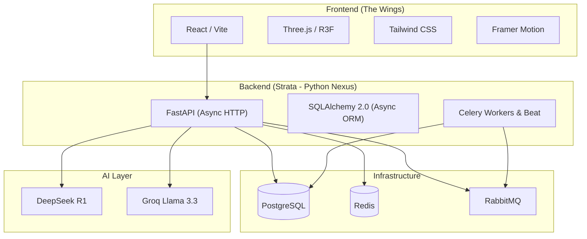
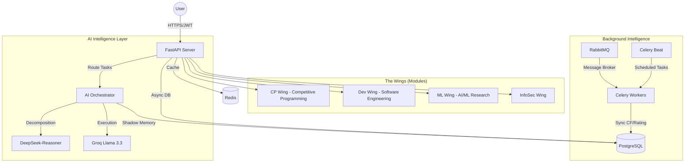
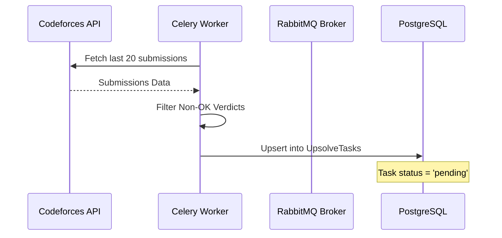
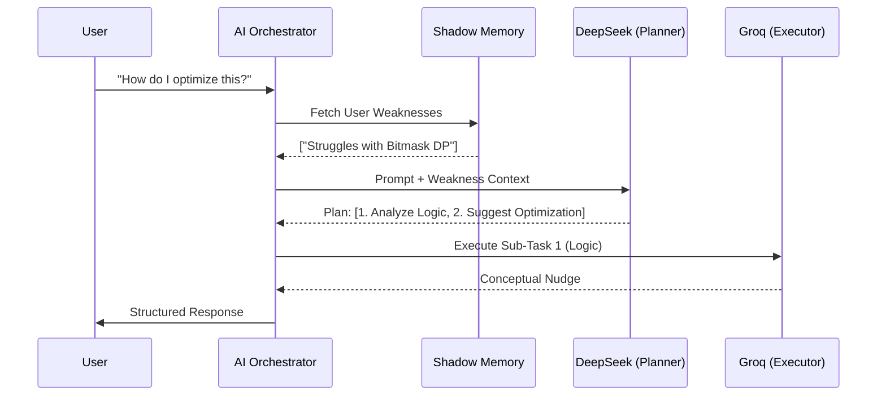

# Strata: The Centralized Technical Nexus 🌐

Strata is a production-grade, AI-driven platform designed to centralize technical growth. It bridges the gap between competitive programming, software engineering, and AI research through a **Decoupled Agentic Architecture**. 

The backend has recently been completely re-architected in Python (FastAPI + Celery) to leverage the rich AI ecosystem, massive asynchronous scalability, and background intelligence.

---

## 🛠️ The Tech Stack

## 🏛️ System Design & Architecture

Strata is built on the principle of **Agentic Orchestration**. It doesn't just process requests; it reasons, plans, and remembers. The backend has been completely rewritten in Python to leverage the rich AI ecosystem and asynchronous task processing.

### 1. Global High-Level Flow
The system heavily separates real-time user interactions from high-latency data synchronization and AI reasoning. Real-time requests are handled instantly, while background tasks (like fetching Codeforces submissions or updating GitHub stats) are offloaded to RabbitMQ and Celery.

---

## 🏎️ CP Wing (Competitive Programming)

The CP Wing is designed to turn failures into growth. It fully automates the "Upsolving" process so developers are forced to learn from their exact mistakes.

### 1. The "Upsolve" Pipeline
This flow ensures that every failed submission on Codeforces is tracked and presented as a learning opportunity in real-time.

### 2. Logic-Only "Nudging"
To prevent cheating and encourage true learning, the **CodeSensei** sub-agent provides logic-only hints. It analyzes the problem and the user's past weaknesses (from Shadow Memory) to give a "nudge" rather than the code. The AI is specifically prompted to never write code blocks for the user.

---

## 🏗️ Dev Wing (Software Engineering)

The Dev Wing focuses on repository health, open-source contributions, and professional representation.

### 1. Repo Health Audit
The system performs a quantitative analysis of GitHub repositories based on:
- **README Presence**: Documentation baseline and clarity.
- **Activity Frequency**: Commits in the last 30 days.
- **Issue Ratio**: Management efficiency (Open vs Closed issues).

### 2. PR AI Audit
Developers can submit a Pull Request URL. The backend fetches the raw diff via the GitHub API and uses the **Architect sub-agent** to perform a security and architectural review before the PR is even merged, catching vulnerabilities and logic flaws.

---

## 🧠 AI Intelligence Layer: The Orchestrator

Strata utilizes a multi-model routing strategy to optimize for reasoning depth and response speed, dynamically switching between DeepSeek and Groq based on task complexity.

### 1. Task Decomposition Flow
When a user asks a complex question (e.g., "How do I optimize my DP for this specific CF problem?"), the **Orchestrator** takes over.

### 2. Shadow Memory Engine
The **Shadow Memory** is a persistent layer that tracks user proficiency (1-10) in technical concepts. 
- **Learning Loop**: Every AI interaction or "Upsolve" success updates the proficiency score.
- **Contextual Injection**: These scores are injected into the system prompt of every AI call, ensuring the AI "knows" exactly where the user is struggling.

---

## 📈 The Strata Rating Algorithm

The Strata Rating is a unified metric that rewards cross-disciplinary excellence. It prevents developers from being "one-trick ponies" by enforcing growth across all domains.
$$StrataRating = (CF_{Rating} \times 0.5) + (CF_{Solved} \times 5) + (GH_{Repos} \times 20) + (GH_{PRs} \times 50)$$
- **Base Logic**: Codeforces Rating (Algorithm efficiency).
- **Consistency**: Problems Solved (Daily persistence).
- **Engineering Output**: GitHub Repositories (Architecture).
- **Quality**: GitHub Pull Requests (Open-source collaboration).

---

## 📂 Repository blueprint

### Backend (`/backend`)
- **`/app/api`**: FastAPI HTTP entry points for Auth, AI, CP, Dev, and ML wings.
- **`/app/services`**: The core "brain"—includes Orchestrator, Multi-Provider routing, and GitHub/Codeforces integrators.
- **`/app/tasks`**: Background Celery workers and Beat schedules for CF Sync and Ratings.
- **`/app/models`**: SQLAlchemy 2.0 ORM models for PostgreSQL.
- **`/app/cache`**: Redis cache aside patterns and invalidation logic.
- **`/alembic`**: Database migration scripts and version history.

### Frontend (`/frontend`)
- **`/src/components/wings`**: Specialized UI for each domain (CPWing, DevWing, MLWing).
- **`/src/components/3d`**: Three.js visualizations (RoadmapBackground, HeroScene).
- **`/src/context`**: Auth and Global State management.

---

## 🛠️ Infrastructure Stack

- **Primary DB**: PostgreSQL (Relational data persistence via asyncpg).
- **Messaging**: RabbitMQ (Task broker for Celery async queue).
- **Cache**: Redis (Fast state caching and rate limiting).
- **Web Framework**: FastAPI (High-performance async Python backend).

---

## 🚀 Use Cases & User Journeys

### 1. The "Silent Mentor" Journey
A user fails a problem on Codeforces. Within 4 hours, the problem appears in their **Upsolve Queue**. They click "Get Nudge", and the AI (aware of their weakness in Segment Trees) provides a hint about the specific logic error without giving the code. The user solves it, and their **Shadow Memory** score for "Segment Trees" increases.

### 2. The "Technical Evolution" Roadmap
A user requests a roadmap for "Frontend + ML". The **Orchestrator** generates a 12-week plan, identifying resources that fill the gaps in their current proficiency, resulting in a 3D interactive roadmap.

---

## 🎨 Design Philosophy
- **Aesthetics**: Dark-mode glassmorphism with neon accents (#A855F7, #22D3EE).
- **Motion**: Framer Motion for seamless transitions.
- **Persona**: The AI behaves as an elite technical mentor—concise, encouraging, and logic-focused.

---
© 2026 Strata Technical Nexus. PHASE 2 (STRATA) ONLINE.
