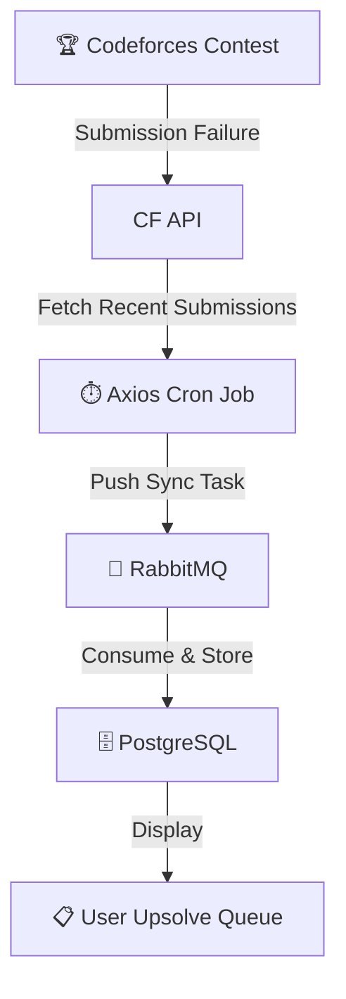
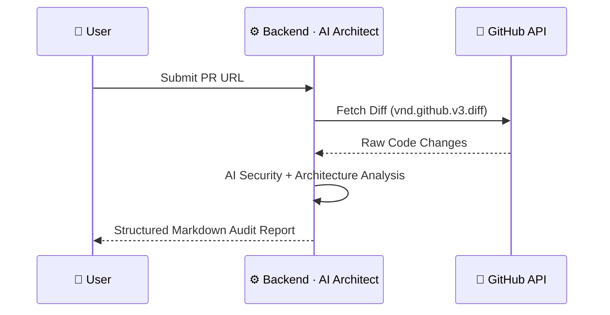
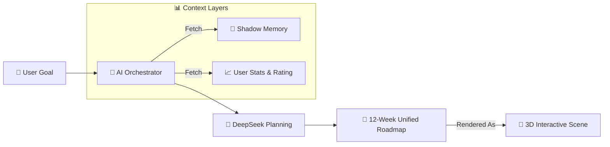

<div align="center">

<br/>


<br/>

```
 ██╗   ██╗███████╗███████╗██████╗      ██╗ ██████╗ ██╗   ██╗██████╗ ███╗   ██╗███████╗██╗   ██╗███████╗
 ██║   ██║██╔════╝██╔════╝██╔══██╗     ██║██╔═══██╗██║   ██║██╔══██╗████╗  ██║██╔════╝╚██╗ ██╔╝██╔════╝
 ██║   ██║███████╗█████╗  ██████╔╝     ██║██║   ██║██║   ██║██████╔╝██╔██╗ ██║█████╗   ╚████╔╝ ███████╗
 ██║   ██║╚════██║██╔══╝  ██╔══██╗██   ██║██║   ██║██║   ██║██╔══██╗██║╚██╗██║██╔══╝    ╚██╔╝  ╚════██║
 ╚██████╔╝███████║███████╗██║  ██║╚█████╔╝╚██████╔╝╚██████╔╝██║  ██║██║ ╚████║███████╗   ██║   ███████║
  ╚═════╝ ╚══════╝╚══════╝╚═╝  ╚═╝ ╚════╝  ╚═════╝  ╚═════╝ ╚═╝  ╚═╝╚═╝  ╚═══╝╚══════╝   ╚═╝   ╚══════╝
```

### **User Journeys & Core Use Cases**

*How every wing of AXIOS-GO drives real, measurable technical growth.*

<br/>

[](#1-competitive-programmer-cp-journey)
[](#2-software-engineer-dev-journey)
[](#3-aiml-researcher-ml-journey)
[](#4-cross-domain-synergy)

</div>

---

<br/>

## ⚔️ Wing 01 · Competitive Programming

> *Turn every failure into a structured learning opportunity.*

<br/>

### Use Case 1.1 · Automated Upsolving

**Objective** — Never lose track of a failed problem.

```
[Contest on Codeforces] ──fail──▶ [CF API logs submission]
          │
          ▼
   AXIOS Cron Job fetches every 4 hours
          │
          ▼
   Pushed to RabbitMQ ──▶ Consumed & stored in PostgreSQL
          │
          ▼
   Problem "C" appears in Upsolve Queue · status: PENDING
```



<br/>

### Use Case 1.2 · CodeSensei "Nudge"

**Objective** — Get unblocked without seeing the solution.

```
User: "Get Nudge" on pending task
          │
          ▼
  Shadow Memory consulted → "Weak in Dynamic Programming"
          │
          ▼
  CodeSensei crafts a logic-only hint:
  ┌─────────────────────────────────────────────────────┐
  │ 💡 "Think about how the state depends on the        │
  │     suffix of the array rather than the prefix."    │
  └─────────────────────────────────────────────────────┘
          │
          ▼
  User implements logic ──▶ Submits to CF ──▶ ✅ Accepted
          │
          ▼
  Task marked "Solved" · Shadow Memory score ↑
```

> **The rule:** The AI never gives you the code. It gives you the *key.*

<br/>

---

## 🏗️ Wing 02 · Software Engineering

> *Audit your work. Review your code. Present yourself professionally.*

<br/>

### Use Case 2.1 · Repository Health Audit

**Objective** — Improve personal project quality with data.

| Step | Action | Output |
|------|--------|--------|
| 1 | Link GitHub handle | Repos listed in Dev Wing |
| 2 | Select a project | Audit initiated |
| 3 | System analyzes repo | README · commits · issue ratio |
| 4 | Receive Health Score | **0 – 100** with actionable suggestions |

**Example output:**
```
┌──────────────────────────────────────────────────────┐
│  REPO HEALTH SCORE · my-portfolio                    │
├───────────────────────┬──────────────────────────────┤
│  README Presence      │  ✅ Found                    │
│  Commit Activity      │  ⚠️  3 commits / 30 days     │
│  Issue Ratio          │  ❌ 12 open, 0 closed        │
├───────────────────────┴──────────────────────────────┤
│  Score: 54 / 100                                     │
│  💡 "Close or triage stale issues to improve ratio"  │
└──────────────────────────────────────────────────────┘
```

<br/>

### Use Case 2.2 · PR AI Review

**Objective** — Catch bugs and architectural issues *before* merging.



**The AI Architect reviews for:**
- 🔐 Security vulnerabilities
- 🏛️ Architectural flaws
- 🎨 Code style & consistency issues

<br/>

### Use Case 2.3 · STAR Resume Generator

**Objective** — Transform commits into compelling resume bullets.

```
Commit history + Repo activity
          │
          ▼
  AI applies STAR framework:
  · Situation  → Context from repo/project
  · Task       → What needed to be done
  · Action     → What you built / changed
  · Result     → Measurable impact
          │
          ▼
  High-impact bullet points ready to paste into your resume
```

<br/>

---

## 🧠 Wing 03 · AI / ML Research

> *Go deep on complex architectures, guided by what you already know.*

<br/>

### Use Case 3.1 · The Concept Lab

**Objective** — Deepen understanding of complex ML architectures.

```
User enters Concept Lab
          │
          ▼
  Query: "Transformers Attention Mechanism"
          │
          ▼
  Shadow Memory fetched:
  ┌──────────────────────┬──────────────┐
  │ Concept              │ Proficiency  │
  ├──────────────────────┼──────────────┤
  │ Linear Algebra       │ 8 / 10       │
  │ Backpropagation      │ 6 / 10       │
  │ Sequence Modeling    │ 4 / 10       │  ← gap detected
  └──────────────────────┴──────────────┘
          │
          ▼
  AI tailors breakdown to user's exact level
  + surfaces papers and resources that fill the gap
```

<br/>

---

## 🌐 Wing 04 · Cross-Domain Synergy

> *Where CP precision meets engineering craft — on a single leaderboard.*

<br/>

### Use Case 4.1 · The Unified Technical Roadmap

**Objective** — Chart a multi-disciplinary 12-week growth path.



**Sample week from a "Fullstack + Algorithmic Mastery" roadmap:**

```
Week 1
├── ⚔️ CP Task    · Master BFS / DFS traversal on graphs
└── 🏗️ Dev Task   · Implement a Graph Visualization component in React

Week 2
├── ⚔️ CP Task    · Solve 3 Shortest Path problems on Codeforces
└── 🏗️ Dev Task   · Build a live Dijkstra's algorithm visualizer
```

*Every week, CP and Dev tasks are intentionally intertwined — so you learn the theory and ship it.*

<br/>

### Use Case 4.2 · The Global Leaderboard

**Objective** — Gamify cross-domain technical growth.

```
Every 24 hours:
          │
          ▼
  All user stats synced (CF Rating · GH Repos · GH PRs · Problems Solved)
          │
          ▼
  Axios Rating calculated:
  AxiosRating = (CF_Rating × 0.5) + (CF_Solved × 5) + (GH_Repos × 20) + (GH_PRs × 50)
          │
          ▼
  Global leaderboard updated — ranked by cross-domain versatility
```

**The leaderboard doesn't just reward grinding one skill. It rewards being well-rounded.**

<br/>

---

<div align="center">

```
┌────────────────────────────────────────────────────────┐
│              AXIOS-GO · USE CASE SUMMARY               │
├───────────────┬────────────────────────────────────────┤
│  ⚔️ CP Wing   │  Upsolving · CodeSensei Nudging        │
│  🏗️ Dev Wing  │  Repo Audit · PR Review · Resume Gen   │
│  🧠 ML Wing   │  Concept Lab · Depth-calibrated AI     │
│  🌐 Synergy   │  Unified Roadmap · Global Leaderboard  │
└───────────────┴────────────────────────────────────────┘
```

<br/>

*Every journey ends with you knowing more than when you started.*

<br/>

**AXIOS-GO** · © 2025 AXIOS Technical Nexus · Developed by **Mohd Arham Farooqui**

<br/>

</div>
